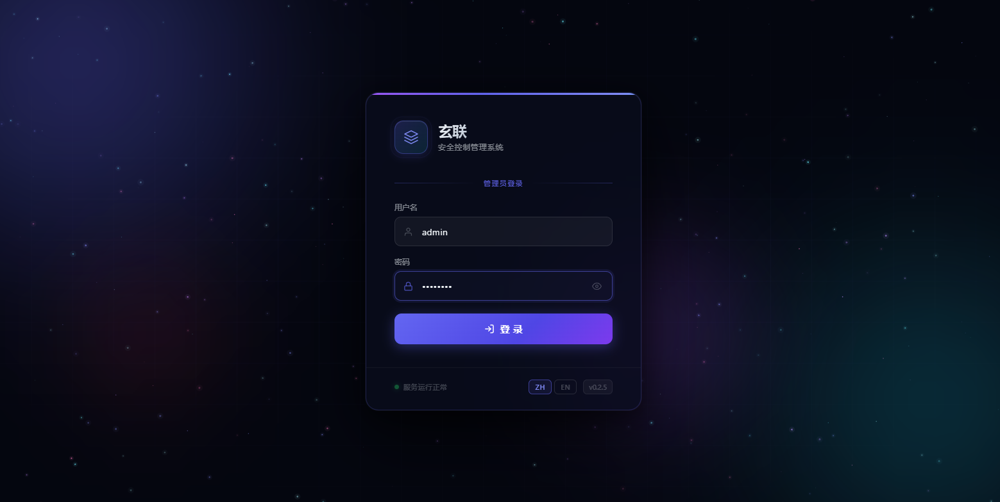
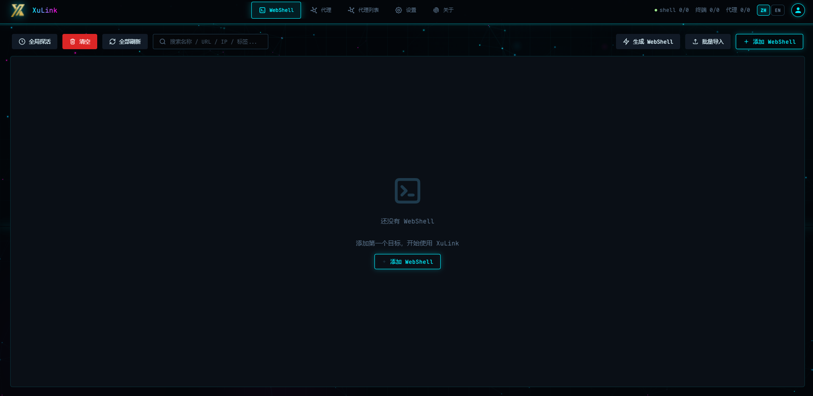
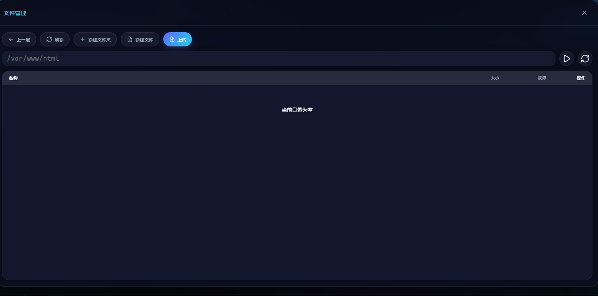

# XuanLink（玄联）

<p align="center">
  
</p>

<p align="center">
  <a href="./README_en.md">English</a> |
  <a href="./docs.md">技术文档</a> |
  <a href="https://github.com/Alex-LILY/XuanLink">GitHub</a>
</p>

**XuanLink（玄联）** 是一款面向授权渗透测试、红队评估与安全研究的现代化 Webshell 管理器。采用 B/S 架构，可直接部署在服务器或本地运行，通过浏览器管理目标会话，避免在本地留存敏感工具痕迹。

---

## 目录

- [功能特性](#功能特性)
- [界面预览](#界面预览)
- [快速开始](#快速开始)
- [使用指南](#使用指南)
- [自定义扩展](#自定义扩展)
- [开发说明](#开发说明)
- [支持矩阵](#支持矩阵)
- [常见问题](#常见问题)
- [安全提示](#安全提示)
- [许可证](#许可证)

---

## 功能特性

### 多协议 Webshell 支持

| 协议 | 支持类型 |
|------|---------|
| **玄联默认** | PHP / JSP / ASPX |
| **冰蝎（Behinder）** | PHP AES/XOR、JSP AES、JSPX AES、ASP XOR、ASPX AES |
| **哥斯拉（Godzilla）** | PHP XOR、ASP XOR、ASPX AES、JSP AES、JSPX AES |
| **Linux 命令** | 直接命令执行 |
| **反弹 Shell** | TCP 监听与持久化连接 |

### 现代化 UI

- 多主题：专业面板、终端、玻璃、赛博、纸面、现代等
- 可自定义字体大小与背景图片
- 会话列表支持标签分组、排序、搜索与批量操作
- 文件管理支持修改时间显示与面包屑导航

### 实用功能

- 会话存活探测与基本信息采集
- 命令执行与文件管理（浏览、上传、下载、编辑）
- PHP 代码执行与 `phpinfo` 下载
- TCP / HTTP / SOCKS5 正向代理与代理池管理
- 反弹 Shell 监听与持久化连接
- 批量导入会话、批量设置分组
- 首次登录强制修改默认密码

### 安全与隐私

- RSA2048 + AES256 加密通信
- 随机 User-Agent 与 HTTP 垃圾数据填充
- 支持自定义 Encoder / Decoder 与部分蚁剑插件导入
- 自定义模块与蚁剑 Encoder 默认关闭，需手动启用

---

## 界面预览

<p align="center">
  <b>主界面</b><br>
  
</p>

<p align="center">
  <b>文件管理</b><br>
  
</p>

---

## 快速开始

### pip 安装（推荐）

```shell
pip install ether-ghost
ether_ghost --host 127.0.0.1 --port 8022
```

### 源码运行

```shell
git clone https://github.com/Alex-LILY/XuanLink.git
cd XuanLink
python -m venv .venv
source .venv/bin/activate  # Windows: .venv\Scripts\activate
pip install -r requirements.txt
python -m ether_ghost --host 127.0.0.1 --port 8022
```

### Poetry 运行

```shell
poetry install
poetry run ether_ghost
```

启动后访问 `http://127.0.0.1:8022`。

> **默认账号**：`admin` / `admin123`  
> 首次登录后系统会强制要求修改默认密码。

### 常用参数

| 参数 | 默认值 | 说明 |
|------|--------|------|
| `--host` | `127.0.0.1` | 监听地址 |
| `--port` | `8022` | 监听端口 |
| `--no-browser` | - | 启动时不自动打开浏览器 |

---

## 使用指南

### 创建会话

1. 打开 Web 界面，点击「添加」
2. 选择 Webshell 类型（玄联 / 冰蝎 / 哥斯拉 / Linux CMD）
3. 填写 URL、密码、连接参数并保存
4. 右键会话选择「探测缓存」测试连接

### 文件管理

进入会话后选择「文件」标签，可浏览目录、上传下载、在线编辑文本文件，并查看文件修改时间。

### 命令执行

进入「终端」标签，可在目标主机执行系统命令，支持交互式命令行与历史记录。

### 正向代理

- **Vessel 正向代理**：通过 PHP 内存马实现的持久化代理
- **伪正向代理**：通过 gopher 协议以 SSRF 方式转发流量

### 反弹 Shell

在「连接器」中创建 TCP 监听，目标连接后即可获得持久化 Shell 会话。

---

## 自定义扩展

### 自定义 Encoder / Decoder

在玄联配置文件夹（启动时打印的路径）中找到 `modules/php_encoders` 或 `modules/php_decoders`，新建 Python 文件并重启生效。

> 注意：自定义模块默认关闭，需设置环境变量 `SHADOWHALBERD_ENABLE_CUSTOM_MODULES=1` 后启动。

### 导入蚁剑插件

将 `.js` 插件文件放入配置文件夹的 `AntSwordEncoder` 或 `AntSwordDecoder` 目录，设置环境变量 `SHADOWHALBERD_ENABLE_ANTSWORD_ENCODERS=1` 后重启。

### 自定义壁纸

将壁纸重命名为 `bg.jpg` / `bg.png` / `bg.webp`，放入配置文件夹，在设置中选择「玻璃」主题即可生效。

---

## 开发说明

### 构建前端

```shell
cd frontend
npm install
npm run build
cd ..
rm -rf ether_ghost/public
mv frontend/dist ether_ghost/public
```

或直接使用：

```shell
bash build.sh
```

### 项目结构

```text
XuanLink/
├── ether_ghost/          # 后端源码（FastAPI）
│   ├── api/              # API 路由
│   ├── core/             # 核心协议
│   ├── sessions/         # Webshell 会话实现
│   ├── session_connectors/  # 反弹 Shell 等连接器
│   ├── wsm_payloads/     # 冰蝎 / 哥斯拉 payload
│   └── public/           # 前端构建产物
├── frontend/             # 前端源码（Vue 3 + Vite）
├── test_environment/     # 本地测试 webshell
├── tests/                # 测试用例
├── assets/               # 预览图与资源
├── build.sh              # 构建脚本
├── pyproject.toml        # Poetry 配置
├── requirements.txt      # pip 依赖
└── README.md
```

---

## 支持矩阵

| 操作 | PHP | JSP/JSPX | ASP | ASPX | Linux |
|------|-----|----------|-----|------|-------|
| 存活探测 | ✓ | ✓ | ✓ | ✓ | ✓ |
| 基本信息 | ✓ | ✓ | ✓ | ✓ | ✓ |
| 命令执行 | ✓ | ✓ | ✓ | ✓ | ✓ |
| 文件列表 | ✓ | ✓ | ✓ | ✓ | ✓ |
| 文件读写 | ✓ | ✓ | ✓ | ✓ | ✓ |
| PHP 代码执行 | ✓ | - | - | - | - |
| TCP 正向代理 | ✓ | - | - | - | - |
| HTTP 正向代理 | ✓ | - | - | - | - |
| SOCKS5 正向代理 | ✓ | - | - | - | - |

---

## 常见问题

### Q: 为什么不支持在网页端添加 encoder / decoder？

Encoder / Decoder 会在服务端启动时作为代码加载。为防止攻击者登录后通过添加恶意代码控制服务器，玄联不支持在网页端添加，必须通过文件方式配置。

### Q: Vessel 是什么？

Vessel 是玄联自研的 PHP 持久化内存马，支持通过文件和 Session 两种方式通信，用于实现稳定的正向代理。

### Q: 玄联 Webshell 与传统一句话木马有什么区别？

传统一句话木马特征明显、易被查杀。玄联 Webshell 同时加密和混淆流量，使用异或编码与特殊 8 字节标记定位 payload，可将流量隐藏在任意数据中，显著降低被检测的概率。

---

## 安全提示

本项目仅用于**授权的安全测试、漏洞研究与教学目的**。使用者应自行承担因未授权使用而造成的法律责任。请勿在未经授权的系统上使用本工具。

---

## 许可证

本项目基于 [MIT License](./LICENSE) 开源。
