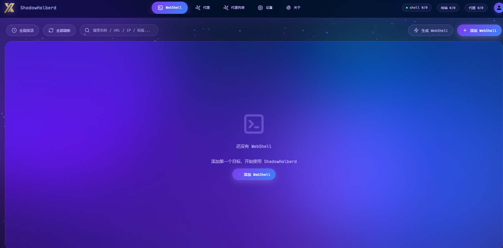
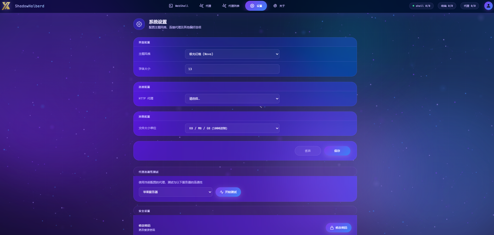
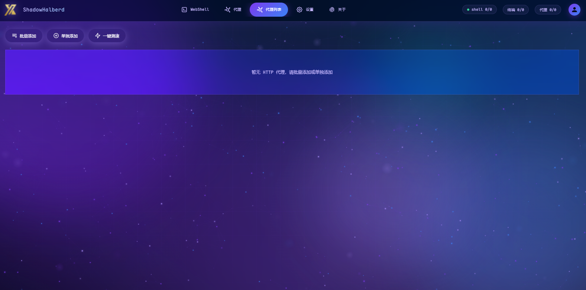

# XuanLink

<p align="center">
  
</p>

<p align="center">
  <a href="./README.md">中文</a> |
  <a href="./docs.md">Documentation</a> |
  <a href="https://github.com/Alex-LILY/XuanLink">GitHub</a>
</p>

**XuanLink** is a modern webshell manager with a clean web UI and broad protocol support, designed for authorized penetration testing, red teaming, and security research.

It runs as a B/S application: deploy it on a server or run it locally, then manage target sessions entirely through your browser, avoiding the need to keep sensitive tooling on your local machine.

---

## Table of Contents

- [Features](#features)
- [Screenshots](#screenshots)
- [Quick Start](#quick-start)
  - [Install from pip](#install-from-pip)
  - [Run from source](#run-from-source)
  - [Run with Poetry](#run-with-poetry)
  - [Common Options](#common-options)
- [User Guide](#user-guide)
  - [Creating a Session](#creating-a-session)
  - [File Management](#file-management)
  - [Command Execution](#command-execution)
  - [Forward Proxy](#forward-proxy)
  - [Reverse Shell](#reverse-shell)
- [Customization](#customization)
  - [Custom Encoder](#custom-encoder)
  - [Custom Decoder](#custom-decoder)
  - [Import AntSword Plugins](#import-antsword-plugins)
  - [Custom Wallpaper](#custom-wallpaper)
- [Development](#development)
  - [Building the Frontend](#building-the-frontend)
  - [Packaging as Executable](#packaging-as-executable)
  - [Project Structure](#project-structure)
- [Supported Operations](#supported-operations)
- [FAQ](#faq)
- [Disclaimer](#disclaimer)
- [License](#license)
- [Acknowledgements](#acknowledgements)

---

## Features

### Multi-Protocol Webshell Support

| Protocol | Supported Types |
|----------|-----------------|
| **XuanLink Native** | PHP / JSP / ASPX |
| **Behinder** | PHP AES/XOR, JSP AES, JSPX AES, ASP XOR, ASPX AES |
| **Godzilla** | PHP XOR, ASP XOR, ASPX AES, JSP AES, JSPX AES |
| **Linux Command** | Direct command execution |
| **Reverse Shell** | TCP reverse shell listener with persistent connections |

### Modern UI

- **New "Modern Dark" theme**: blue-purple gradients, glassmorphism cards, animated background
- **Multiple preset themes**: Pro Panel, Command Terminal, Aurora Glass, Cyber Neon, Parchment
- **Customizable font size and background image**

### Practical Features

- Alive probing, basic information collection, command execution
- File management: directory browsing, file read/write, upload, download
- PHP code execution and `phpinfo` download
- TCP forward proxy and pseudo-forward proxy (gopher/SSRF)
- AntSword integration to leverage part of its plugin ecosystem
- Reverse shell listener with persistent connections

### Security & Privacy

- **RSA2048 + AES256-CBC** encrypted communication
- Random User-Agent and HTTP junk-data padding
- Custom encoders/decoders with partial AntSword encoder support
- XuanLink webshell uses encryption + obfuscation to hide traffic inside random data

---

## Screenshots

<p align="center">
  <b>Main Interface</b><br>
  
</p>

<p align="center">
  <b>Settings</b><br>
  
</p>

<p align="center">
  <b>Proxy List</b><br>
  
</p>

---

## Quick Start

### Install from pip

```shell
pip install ether-ghost
ether_ghost --host 127.0.0.1 --port 8022
```

### Run from source

```shell
git clone https://github.com/Alex-LILY/XuanLink.git
cd XuanLink
python -m venv .venv
source .venv/bin/activate  # Windows: .venv\Scripts\activate
pip install -r requirements.txt
python -m ether_ghost --host 127.0.0.1 --port 8022
```

### Run with Poetry

This project uses [Poetry](https://python-poetry.org/) for dependency management:

```shell
poetry install
poetry run ether_ghost
```

Open `http://127.0.0.1:8022` in your browser.

### Common Options

| Option | Default | Description |
|--------|---------|-------------|
| `--host` | `127.0.0.1` | Bind address |
| `--port` | `8022` | Bind port |
| `--no-browser` | `false` | Do not open browser automatically |
| `--auth USER:PWD` | - | Enable basic auth for the API |

---

## User Guide

### Creating a Session

1. Open the web UI and click "New Session"
2. Select the webshell type (XuanLink / Behinder / Godzilla / Linux CMD)
3. Fill in the URL, password, and connection parameters
4. Save and click "Connect" to test

### File Management

After entering a session, select the "Files" tab to:

- Browse the target host directory structure
- Upload, download, delete, and rename files
- Edit text files online

### Command Execution

Select the "Terminal" tab to execute system commands on the target host, featuring:

- Interactive command line
- Command history
- Real-time output display

### Forward Proxy

XuanLink supports two types of forward proxy:

- **Vessel Forward Proxy**: A persistent proxy implemented via PHP memory shell, supporting both file and Session communication
- **Pseudo-Forward Proxy**: Forwards traffic via the gopher protocol in an SSRF-like manner, mainly suitable for HTTP-like protocols

### Reverse Shell

Create a TCP listener in "Connectors". Once the target host connects, you get a persistent shell session.

---

## Customization

### Custom Encoder

Open the XuanLink configuration folder (printed at startup), find the `modules/php_encoders` directory, and create a Python file:

```python
import base64

def encode(code: str):
    return f"eval(base64_decode({base64.b64encode(code.encode()).decode()!r}));"
```

Restart XuanLink and the encoder will appear in the webshell editing page.

### Custom Decoder

Create a Python file under `modules/php_decoders`:

```python
import base64

phpcode = """
function decoder_echo_raw($s) {
    echo base64_encode($s);
}
"""

def decode(s: str) -> str:
    return base64.b64decode(s).decode()
```

Restart to take effect.

### Import AntSword Plugins

Find the `AntSwordEncoder` or `AntSwordDecoder` directory in the configuration folder, drop in the corresponding `.js` files, and restart.

Example `AntSwordEncoder/example-base64.js`:

```js
module.exports = (pwd, data, ext={}) => {
    let randomID = `_0x${Math.random().toString(16).substr(2)}`;
    data[randomID] = Buffer.from(data['_']).toString('base64');
    data[pwd] = `eval(base64_decode($_POST[${randomID}]));`;
    delete data['_'];
    return data;
}
```

> Note: XuanLink does not support some AntSword environment variables that are tightly coupled with AntSword internals. Some plugins may need modification before use.

### Custom Wallpaper

Rename your wallpaper image to `bg.jpg`, `bg.png`, or `bg.webp`, place it in the XuanLink configuration folder, then set the theme to "Glass" in the settings page.

---

## Development

### Building the Frontend

The frontend lives in `frontend/` and is built with Vite. After any frontend change you must rebuild:

```shell
cd frontend
npm install
npm run build
cd ..
rm -rf ether_ghost/public
mv frontend/dist ether_ghost/public
```

Or use the root script:

```shell
bash build.sh
```

> Note: The build output in `ether_ghost/public/` should be committed together with the source changes, never on its own.

### Packaging as Executable

#### Linux

```shell
bash build.sh
pip install pyinstaller
python pyinstaller_package.bat  # Adjust paths inside the script first
```

#### Windows

See [`pyinstaller_package.bat`](./pyinstaller_package.bat), replace the virtual-environment path with your local `site-packages` directory, then run it.

### Project Structure

```text
XuanLink/
├── ether_ghost/          # Backend source
│   ├── api/              # FastAPI routes
│   ├── core/             # Core protocols and generators
│   ├── sessions/         # Webshell session implementations
│   ├── session_connectors/  # Persistent connectors (reverse shell, etc.)
│   ├── wsm_payloads/     # Behinder / Godzilla payloads
│   └── public/           # Frontend build output
├── frontend/             # Frontend source (Vue 3 + Vite)
├── test_environment/     # Local test webshells
├── tests/                # Test cases
├── assets/               # Project screenshots and assets
├── build.sh              # Frontend build script
├── pyproject.toml        # Poetry configuration
├── requirements.txt      # pip dependencies
└── README.md             # Chinese README
```

---

## Supported Operations

| Operation | PHP | JSP/JSPX | ASP | ASPX | Linux |
|-----------|-----|----------|-----|------|-------|
| Alive probe | ✓ | ✓ | ✓ | ✓ | ✓ |
| Basic info | ✓ | ✓ | ✓ | ✓ | ✓ |
| Command exec | ✓ | ✓ | ✓ | ✓ | ✓ |
| File listing | ✓ | ✓ | ✓ | ✓ | ✓ |
| File R/W | ✓ | ✓ | ✓ | ✓ | ✓ |
| PHP eval | ✓ | - | - | - | - |
| TCP forward | ✓ | - | - | - | - |

---

## FAQ

### Q: Why can't encoders and decoders be added from the web UI?

Encoders and decoders are loaded as code when the server starts. If an attacker logs into your XuanLink instance, they could take control of the server by adding an encoder. To prevent RCE vulnerabilities, XuanLink does not support adding encoders/decoders from the web UI.

### Q: What is Vessel? Why are there two forward proxy modes?

Vessel is a custom PHP memory shell developed for XuanLink, supporting both file and Session communication. The pseudo-forward proxy forwards traffic via the gopher protocol in an SSRF-like manner and is basically limited to HTTP-like protocols.

### Q: How is the XuanLink webshell different from traditional one-liner webshells?

Traditional one-liner webshells have obvious features and are easily detected. XuanLink webshell encrypts and obfuscates traffic, uses XOR encoding, and uses special 8-byte markers to locate the payload. This allows the payload to be embedded in arbitrary data such as images, significantly reducing the chance of detection.

---

## Disclaimer

This project is intended only for **authorized security testing, vulnerability research, and educational purposes**. Users are solely responsible for any legal consequences arising from unauthorized use. Do not use this tool on systems without explicit authorization.

---

## License

This project is open-sourced under the [MIT License](./LICENSE).

---

## Acknowledgements

Inspired by excellent tools such as AntSword, Behinder, and Godzilla, with reference to implementations such as [EtherGhost](https://github.com/Marven11/EtherGhost) and [wsm](https://github.com/xiecat/wsm).
